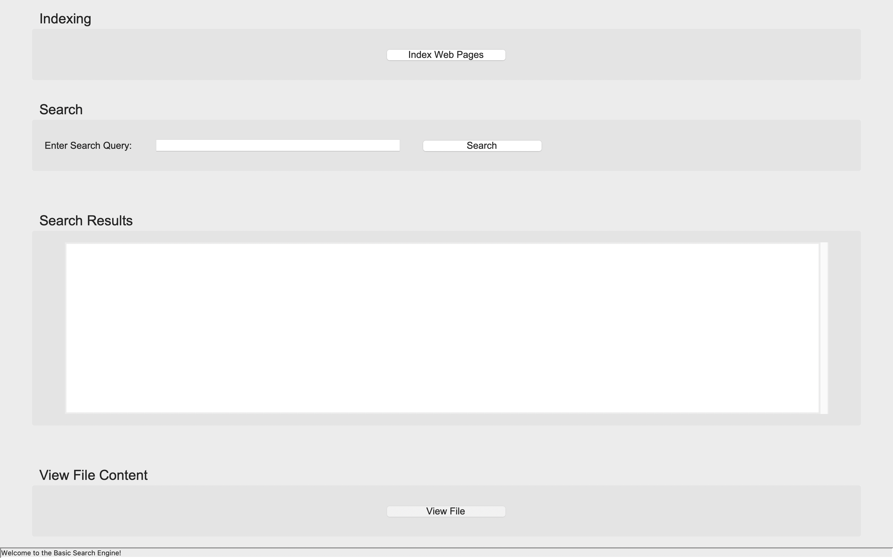

# Basic Search Engine with GUI

This project is a Python-based Basic Search Engine that provides functionality for indexing and searching through text files. It includes a graphical user interface (GUI) built with the Tkinter library, which allows users to easily interact with the search engine through an intuitive and simple interface. The project is divided into two main components: the search engine logic implemented in Python (search_engine.py) and the graphical interface (search_engine_GUI.py).

## Table of Contents

- [Features](#features)
- [Demo](#demo)
- [Project Structure](#project-structure)
- [Usage](#usage)
- [Example Use Case](#example-use-case)
- [Future Enhancements](#future-enhancements)
- [License](#license)

## Features

- **Indexing:** The search engine can index all text files (.txt) within a selected folder. When files are indexed, the search engine reads the content, extracts individual words, and keeps track of their occurrence counts. Each word is stored in a dictionary with the file name and count information, allowing for quick and efficient searches.
- **Search Functionality:** The search engine allows users to input a search query consisting of one or more words. It performs a search on the indexed files and returns results showing the number of matches for each file. The results are displayed in order of relevance (files with the highest number of occurrences are shown first).
- **Graphical User Interface (GUI):** Built with Tkinter, providing an intuitive and responsive user experience. The graphical interface runs in full-screen mode by default but can be toggled using the Esc key. The GUI provides several widgets such as buttons, input fields, and text areas that allow the user to perform tasks like indexing files, searching, and viewing results in a user-friendly way.
- **View File Content:** The GUI also provides a feature where users can select an indexed file and view its content. This makes it easy for users to see the full text of files that match their search query, all from within the same interface.
- **Real-time Feedback:** Displays indexing progress and search status updates to keep users informed.
- **Error Handling and User Feedback:** The project includes robust error handling for scenarios such as invalid folder paths, non-existent files, and other common issues. It provides clear messages to the user when issues occur and ensures a smooth experience by giving feedback for each action performed (e.g., when files are successfully indexed or when no search results are found).

## Demo



## Project Structure
- **search_engine.py:** This file contains the core logic for the search engine. It includes the BasicSearchEngine class, which handles file indexing and searching, and the WordInfo class, which stores information about occurrences of words in files. Users can search for keywords, and the search engine will return the text files where the words are found, along with a relevance score based on the number of occurrences.

- **search_engine_GUI.py:** This file contains the GUI implementation using Tkinter. The graphical interface allows users to easily index files, perform searches, and view the content of indexed files. It also provides options for full-screen mode and has interactive widgets for selecting files and displaying results.

## Usage

### Requirements
To run this project, ensure you have the following:

- Python 3.6+
- Tkinter (Comes pre-installed with most Python distributions)

Install any additional dependencies by running:

```pip install -r requirements.txt```

### Running the Search Engine
1. **Clone the Repository:**
   
```git clone https://github.com/HaykuhiMk/Basic-Search-Engine.git```

```cd ./Basic-Search-Engine/GUI-version```

2. **Run the GUI:**

```python3 main.py```
   
3. **Indexing Files:**

- Click the "Index Web Pages" button in the GUI.
- Select the folder containing .txt files that you want to index.
- Once the indexing is complete, you will receive feedback in the GUI indicating the number of files indexed.

4. **Performing a Search:**

- In the search bar, enter the word or phrase you want to search for.
- Click the "Search" button to see the results, which will display the matching files and their relevance scores.

5. **Viewing File Content:**

- After performing a search, you can click the "View File" button to select and view the contents of any of the indexed files.
  
## Example Use Case
- You can use this project to index and search through a collection of text files, such as website content, articles, or research papers. For example, you could index all .txt files in a folder, search for specific keywords, and then quickly identify the most relevant documents for further reading.

## Future Enhancements
Some potential future improvements for this project include:

- **Phrase Searching:** Allow users to search for exact phrases rather than individual words.
- **File Type Support:** Expand the file indexing to support other text formats such as .pdf and .docx.
- **Database Integration:** Store the index data in a database for faster searching in larger datasets.

## Contribution Guidelines
If you wish to contribute to this project, feel free to submit a pull request. Before contributing, please:

1. Fork the repository.
2. Create a new branch for your feature or bug fix.
3. Write descriptive commit messages.
4. Make sure the code follows PEP 8 standards.
5. Test the application to ensure that everything works correctly.


